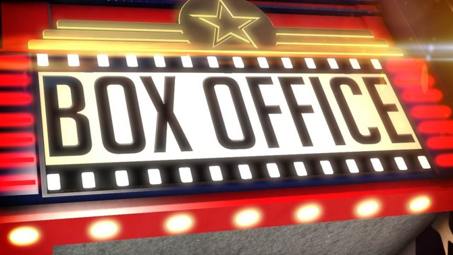
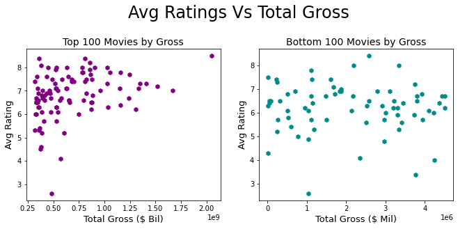
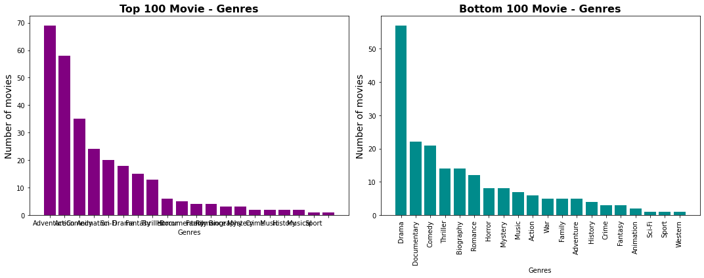

  

# Movie Analysis Project

## Overview & Business Problem
Microsoft sees big companies creating original video content and they want to do get in on the action. They've decided to a create a new movie studio, but don’t know what type of movies they should make.

Without a solid understanding of the current movie landscape, Microsoft will not be able to make confident decisions on content creation. Therefore, this analysis will use data from online data bases, IMDB and Box Office Mojo, to identify trends and highlight elements that typically make a movie successful. For example, does critical acclaim (high ratings) translate to higher revenue.

*For this analysis 'success' is defined as box office revenue, i.e., 'gross'.

## The Data & Method
The data for this analysis came IMDB and Box Office Mojo as they have large databases, tracking many features of each movie. For example, IMDB can collate a large number of online reviews from a wide variety of sources to provide a representative average rating.

The IMDB data (includes two data sets - "Basics" and "Ratings") describes the movie titles, release year, genres, running time, and ratings for movies from 2010 to present including future releases.

The Box Office Mojo data details the domestic (US) and foreign gross each movie earned from 2010 to 2018.

Only movie data from 2015 to 2022 was analysed to focus on the most recent and relevant trends. The average ratings, genres, and runtimes were compared against the movies' total gross (combined domestic(US) and foreign gross) to identify elements of success.

## Results 
### Average Ratings 
There is a very weak positive relationship between average ratings and total gross (r=0.135). 
However, the charts (below) show the relationship does strengthen at the top end of movie grosses (Top 100 r = 0.329).  
Meaning, the higher the average rating, gross will likely increase by a small degree also.

### Runtime 
There is a weak positive relationship between runtime and total gross (r=0.137). 
However, like average ratings, the relationship becomes stronger for higher grossing movies. 
Top 100 Movies are, on average, 18% longer than Bottom 100 Movies. 

### Genres 
The composition of genres in the Top and Bottom 100 Movies is clearly very different.
Adventure and action are very popular in the Top 100 Movies. However, Drama and documentary, the most popular genres in Bottom 100, only rank 6th and 10th  respectively, in the Top 100. 
Comedy came in as the 3rd most common for both Top and Bottom 100, indicating other deeper factors need to be examined to establish what makes a successful comedy movie. 

 
 
## Recommendations
Microsoft should not try to make content decisions based on potential movie ratings as:

 1. The impact of ratings on gross is rather minor, and;
 2. A studio has limited direct control over future reviews.
 3. The runtime influence is also minor, but it is worth noting the significant difference in average runtime between Top and Bottom 100 Movies. This indicates  
 4. audiences prefer longer, epic-like movies and is an area Microsoft should research for further insights.

Microsoft should focus on action and adventure movies and avoid dramas and documentaries. The clearest distinction between the Top and Bottom 100 is the composition of genre, so this area should be considered most seriously.

Microsoft could consider the list of studios that produced the Top 100 and research further how these studios operate to gain insights on how successful movies are chosen and produced.

## Conclusion
This analysis demonstrated the major factor influencing a movie’s success is the genre. Audiences have a strong preference for action and adventure movies and, to a lesser extent, comedy and animation. This analysis only looked at movie gross. Further research should examine movies by net profit and less to gain a better understanding profitability. Other factors, ratings and runtime, were not strongly correlated with the total movie gross.

## Next Steps
Conduct further research into movie production costs to understand the relationship between ratings, runtime, and genre and net profit or loss.

Explore other related factors to find stronger relationships. For example, the movie rating appeared to have little impact on movie gross, but number of reviews/ratings (i.e., level of media exposure) may be more impactful and worth examining.
